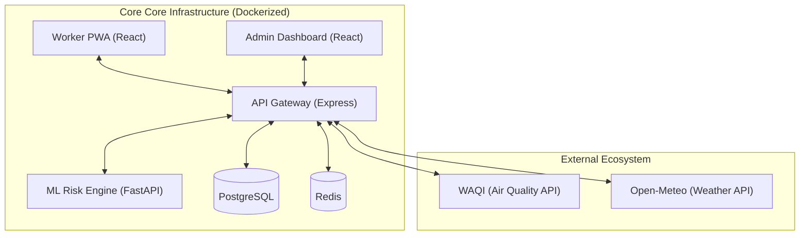

# 🛡️ GigShield: AI-Driven Climate Risk Insurance for the Gig Economy


[](https://www.docker.com/)
[](https://reactjs.org/)
[](https://nodejs.org/)
[](https://fastapi.tiangolo.com/)

**GigShield** is a revolutionary, full-stack monorepo designed to mitigate risk for gig workers via real-time, weather-adaptive insurance. By combining state-of-the-art ML risk modeling with a low-latency Node.js API and a high-performance React PWA, we ensure that workers stay protected even when the climate doesn't cooperate.

---

## 🏛️ System Architecture

### Orchestration Model


---

## ✨ Premium Features

### 🛵 Intelligent Worker PWA
*   **Adaptive UI**: Dynamic interface that shifts based on local air quality and weather data for 8+ Indian metros.
*   **Seamless Onboarding**: One-minute verification flow with persistent state handling via Redis-backed sessions.
*   **Zero-UI Claims**: Intelligent claim filing using real-time GPS telemetry and env-trigger verification.

### 💼 Admin Intelligence Dashboard
*   **Dynamic Claim Hub**: Real-time WebSocket feed of all incoming claims with high-signal risk analysis.
*   **Fraud Sentry**: 3-stage security wall including Location Guard, Risk-Velocity metrics, and Duplicate detection.
*   **Zone Heatmaps**: High-fidelity geographic visualizations of claim density and weather severity.

### 🧠 ML-Driven Risk Engine
*   **Probability Scoring**: High-precision risk assessments (0-1.0) derived from seasonal historical trends.
*   **Fault-Tolerant Pipelines**: Automated fallback logic ensures continuous system operation during high-load peaks.

---

## 🛠️ Technical Ecosystem

| Layer | Technologies |
| :--- | :--- |
| **Frontend** | React 18, Vite, Vanilla CSS (Premium Dark Mode) |
| **Backend** | Node.js 20, Express, PostgreSQL (pg-node) |
| **Machine Learning** | Python 3.9, FastAPI, Pandas, Scikit-learn |
| **Cache & Real-time** | Redis 7, Socket.io |
| **Deployment** | Docker, Docker-compose |

---

## 🚀 Rapid Deployment

### 1. Configure the Environment
Clone the repository and initialize the secure environment variables:
```bash
# Clone the repository
git clone https://github.com/[your-repo]/gigshield.git
cd gigshield

# Set up local configuration
cp .env.example .env
```

### 2. Orchestrate & Launch
Run the entire suite with a single command. Docker handles the complexity:
```bash
docker-compose up --build -d
```

### 3. Service Map
| Service | Endpoint | Description |
| :--- | :--- | :--- |
| **Worker PWA** | [http://localhost:5173](http://localhost:5173) | Main interface for Gig Workers |
| **Admin Dashboard** | [http://localhost:5174](http://localhost:5174) | Claims and management dashboard |
| **Backend API** | [http://localhost:3001](http://localhost:3001) | Core API Gateway & Business logic |
| **ML Service** | [http://localhost:8000](http://localhost:8000) | Risk analysis & ML engine |

---

## 🌐 Cloud Deployment

The GigShield monorepo is optimized for hybrid cloud hosting. For maximum stability and cost-efficiency, we recommend a split-hosting strategy.

### 1. Frontends (Vercel)
Ideal for the Worker PWA and Admin Dashboard.
- **Root Directory**: `frontend-worker` (for PWA) and `frontend-admin` (for Admin).
- **Build Command**: `npm run build`
- **Output Directory**: `dist`
- **Environment Variables**: Set `VITE_API_URL` to your deployed Backend URL.

### 2. Backend & ML Service (Railway / Render)
We recommend **Railway** or **Render** for these services as they provide persistent Docker environments, which are necessary for `node-cron` tasks and consistent ML model performance.
- **Context**: Root of the repository.
- **Dockerfiles**: Use the existing `Dockerfile` in `/backend` and `/ml-service`.
- **Healthcheck**: `/health` (ML) and `/` (Backend).

### 3. Production Databases
For data persistence in the cloud, consider:
- **Postgres**: [Supabase](https://supabase.com) or [Neon.tech](https://neon.tech).
- **Redis**: [Upstash](https://upstash.com) (Serverless Redis).

---

## 🛡️ Multi-Tier Fraud Prevention
GigShield implements a sovereign security layer to protect insurance reserves:
-   **Temporal Shield**: Prevents rapid-fire claim spam (30-min cooldown).
-   **Geo-Fencing**: Validates claims against hyper-local weather telemetry and verified GPS data.
-   **ML Thresholds**: Automatically flags any claim with a risk score above 0.8 for manual human audit.
## 🎤 Pitch Deck

🚀 Explore the vision, architecture, and impact of **GigShield**:

🔗 **Live Deck**: [Click here to view](https://1drv.ms/p/c/2de6e89f1affa0db/IQCB2OBmWrBUSpzmF_CsjQKBAfp9hKyeRRGHIlU6hReBMWg?e=xQJh6x)
---
